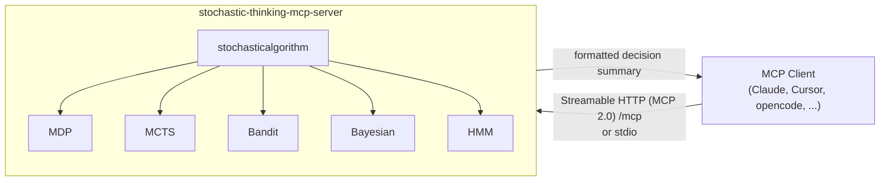

# Stochastic Thinking MCP Server

> Stochastic algorithms and probabilistic decision-making — as an MCP tool for AI agents.

[](https://github.com/chirag127/Stochastic-Thinking-MCP-Server/blob/main/LICENSE)
[](https://github.com/chirag127/Stochastic-Thinking-MCP-Server/stargazers)
[](https://github.com/chirag127/Stochastic-Thinking-MCP-Server/commits)
[](https://nodejs.org/)
[](https://smithery.ai/server/@chirag127/stochastic-thinking-mcp-server)

## What it is / why it exists

An [MCP](https://modelcontextprotocol.io) server that extends an agent's sequential thinking with **probabilistic decision-making**. When a problem involves uncertainty, sequential planning, or a large decision space, the agent calls one tool — `stochasticalgorithm` — and picks a mathematical model (MDP, MCTS, multi-armed bandit, Bayesian optimization, HMM) to escape local optima and explore alternative solution paths.

One tool, five algorithms, zero required configuration.

## Links

- **Live MCP endpoint:** <https://stochastic-thinking-mcp-server.oriz.in> (Streamable HTTP, MCP 2.0)
- **GitHub Pages:** <https://chirag127.github.io/Stochastic-Thinking-MCP-Server/>
- **Smithery:** <https://smithery.ai/server/@chirag127/stochastic-thinking-mcp-server>
- **Repo:** <https://github.com/chirag127/Stochastic-Thinking-MCP-Server>

⭐ If this is useful, please star the repo — it helps others find it.

## Architecture



## Algorithms

| Algorithm | Use case |
| --- | --- |
| **MDP** — Markov Decision Processes | Sequential decisions with defined rewards |
| **MCTS** — Monte Carlo Tree Search | Game/strategy planning over large decision spaces |
| **Multi-Armed Bandit** | A/B testing, resource allocation, online learning |
| **Bayesian Optimization** | Hyperparameter tuning, expensive-function optimization |
| **HMM** — Hidden Markov Models | Time series, pattern recognition, state inference |

## Features

- Single `stochasticalgorithm` tool with an `algorithm` selector: `mdp` · `mcts` · `bandit` · `bayesian` · `hmm`
- Two transports: **stdio** (local clients) and **Streamable HTTP** (MCP 2.0, remote)
- Zero required configuration — no keys, no external calls
- Installable via `npx`, [Smithery](https://smithery.ai), or the hosted endpoint

## Tech stack

- **Node.js** (ESM, `>=18`)
- [`@modelcontextprotocol/sdk`](https://github.com/modelcontextprotocol/typescript-sdk) `^1.29`
- `esbuild` bundle build, plain-JS test harness

## Repo structure

```
Stochastic-Thinking-MCP-Server/
├── index.js          # tool logic + stdio transport
├── http.js           # Streamable HTTP transport (MCP 2.0) at /mcp
├── test.js           # test harness
├── docs/             # GitHub Pages landing (index.html + CNAME)
├── Dockerfile        # container image
├── smithery.yaml     # Smithery deploy config
└── package.json
```

## Quick start

### Install via Smithery

```bash
npx -y @smithery/cli install @chirag127/stochastic-thinking-mcp-server --client claude
```

### MCP client config

Hosted (Streamable HTTP):

```json
{
  "mcpServers": {
    "stochastic-thinking": {
      "url": "https://stochastic-thinking-mcp-server.oriz.in/mcp"
    }
  }
}
```

Local (stdio):

```json
{
  "mcpServers": {
    "stochastic-thinking": {
      "command": "node",
      "args": ["/path/to/Stochastic-Thinking-MCP-Server/index.js"]
    }
  }
}
```

### Run it yourself

```bash
npm install
npm start                         # stdio
HTTP_PORT=3778 node http.js       # Streamable HTTP at http://localhost:3778/mcp
```

### Call the tool

```json
{
  "algorithm": "mdp",
  "problem": "Optimize route selection for delivery vehicles",
  "parameters": { "states": 10, "gamma": 0.95, "learningRate": 0.1 }
}
```

### Register it

- **MCP Registry:** <https://registry.modelcontextprotocol.io>
- **Smithery:** `@chirag127/stochastic-thinking-mcp-server` — <https://smithery.ai/server/@chirag127/stochastic-thinking-mcp-server>

## Configuration

No configuration is required. Optional environment variables:

| Variable | Purpose |
| --- | --- |
| `HTTP_PORT` | Port for the Streamable HTTP transport (default `3778`) |

## Part of the oriz family

One of ~80 sites and tools in the [oriz](https://blog.oriz.in) family. Pairs with the [Clear Thought MCP Server](https://github.com/chirag127/Clear-Thought-MCP-server) (structured reasoning) and [knowledge-mcp](https://github.com/chirag127/knowledge-mcp) (knowledge base).

## Contributing

Issues and PRs welcome. Conventional commits are the changelog.

## License

MIT — see [LICENSE](LICENSE).

## Author

Chirag Singhal · <chirag@oriz.in> · [@chirag127](https://github.com/chirag127)

## Status

Stable. Roadmap: more algorithms, richer parameter validation.
